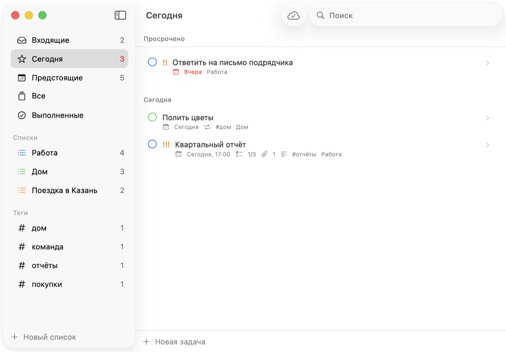
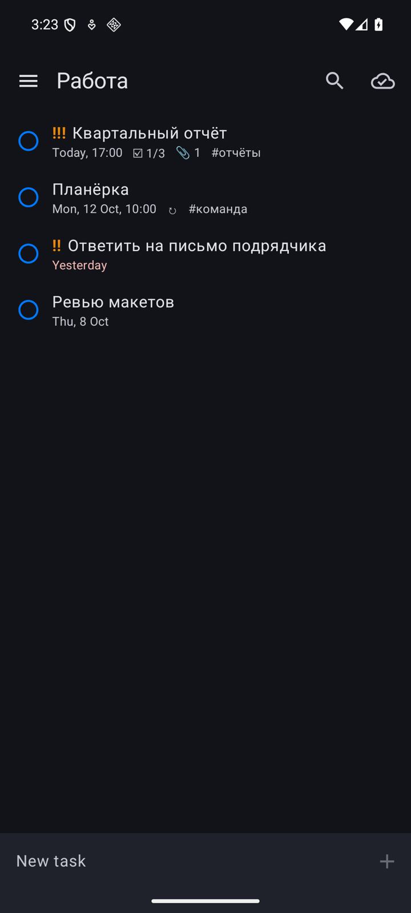
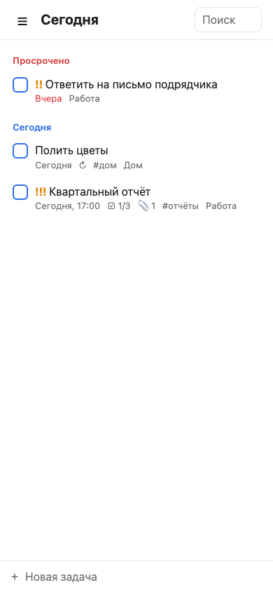

# Lists

[](https://github.com/juev/lists/actions/workflows/ci.yml)
[](https://github.com/juev/lists/releases)

A local-first to-do list with native apps for macOS and Android, a self-hosted web interface, and sync through storage you already own: a WebDAV folder, a CalDAV server or a plain directory. No account, no service to subscribe to.

Lists covers the part of 2Do that a single person uses every day: lists, dates, priorities, tags, repeats, attachments and subtasks that are full tasks. Everything works offline; edits made on two devices to different fields of the same task are both kept.

The interface is in English with a Russian localization and follows the system language.

| macOS | Android | Web |
|---|---|---|
|  |  |  |

More screenshots are in [docs/screenshots](docs/screenshots/).

## Install

Every release on the [Releases page](https://github.com/juev/lists/releases) carries the macOS disk image, the Android APK and a `SHA256SUMS` file; the web server is published as a Docker image.

### macOS

Needs macOS 14 or newer on Apple silicon.

1. Download `Lists-<version>-macos-arm64.dmg` and open it.
2. Drag Lists to Applications and start it from there.

A release whose notes say the build is not notarized is refused by macOS on first start. Remove the quarantine flag once:

```sh
xattr -dr com.apple.quarantine /Applications/Lists.app
```

The share extension works only in notarized builds and in builds [made with your own certificate](#building-from-source).

### Android

Needs Android 8.0 or newer (arm64 or x86_64).

1. Download `Lists-<version>-android.apk` on the phone.
2. Open the file and allow the browser or file manager to install apps when Android asks.

Every release is signed with the same key, so a newer APK installs over the older one and keeps the data. The SHA-256 fingerprint of the signing certificate is `4aca5869f8c3b2ffc45fa2b62530d5c15fb6790fcc37bcc9c94e3b170cf63c09`; `apksigner verify --print-certs` shows it.

### Web interface

The image `ghcr.io/juev/lists` is built for amd64 and arm64.

```sh
docker run -d --name lists \
  -p 8080:8080 \
  -v lists-data:/data \
  -e LISTS_WEB_PASSWORD='choose a password' \
  ghcr.io/juev/lists:latest
```

Open `http://<host>:8080` and sign in with the password. Sync, OpenID Connect, a Compose file and the reverse proxy are covered in [docs/self-hosting.md](docs/self-hosting.md).

## First steps

1. Type a task into the entry field and press Enter. One line is enough: `report friday 10:00 !! #work @Projects` sets the due date, a medium priority, a tag and the list.
2. Open Settings → Sync on each device and point them all at the same WebDAV folder or CalDAV server. Until then the data stays on the device, and the app is fully usable.
3. Coming from another task manager? Import a 2Do backup, a Todoist CSV, a Trello board or Microsoft To Do lists: File → Import… on macOS, Settings on Android, the sidebar in the web interface.

The [user guide](docs/usage.md) describes lists, subtasks and projects, repeats, quick entry, filters, notifications, keyboard shortcuts and import.

## Sync

| Kind | What is stored | When to pick it |
|---|---|---|
| WebDAV or folder | the app's own change log, full fidelity | any WebDAV server, a mounted share, a folder synced by another tool |
| CalDAV | one VTODO per task, a calendar per list | tasks should also be visible in other CalDAV clients |

With CalDAV everything the app knows travels in a custom property next to the standard ones, edits made by other clients are picked up, and their own properties are preserved. Servers that strip unknown properties reduce it to the standard fields. Details: [docs/specs/caldav.md](docs/specs/caldav.md).

The data in the storage is not encrypted by the app. The storage password is kept in the macOS keychain and, on Android, encrypted with a key from the Android Keystore; it is never written to the database.

## Documentation

| Document | What it covers |
|---|---|
| [docs/usage.md](docs/usage.md) | using the apps and the web interface |
| [docs/self-hosting.md](docs/self-hosting.md) | running the web server: Docker, settings, sign-in, reverse proxy |
| [docs/releasing.md](docs/releasing.md) | cutting a release, signing keys and repository secrets |
| [docs/architecture.md](docs/architecture.md) | design decisions and their reasons (in Russian) |
| [docs/specs](docs/specs/) | requirements, data model, sync rules, CalDAV mapping, import (in Russian) |

## Building from source

| Path | What |
|---|---|
| `core/` | Rust crate: storage (SQLite), merge of concurrent edits, sync, recurrence, quick-entry parsing |
| `apple/` | macOS app and share extension, SwiftUI |
| `android/` | Android app, Kotlin and Jetpack Compose |
| `web/` | `lists-web`: a small server with the same core and a web interface |
| `scripts/` | builds the core for each platform and generates the bindings |

The apps reach the core through [UniFFI](https://mozilla.github.io/uniffi-rs/) bindings generated at build time; generated files are not committed. The Rust version is pinned in `rust-toolchain.toml`.

Core and web server, on any machine with Rust:

```sh
make test    # unit tests, behaviour tests, sync tests, sync over a local WebDAV server
make lint    # rustfmt and clippy
make web     # web/target/release/lists-web
```

macOS app (Xcode 16 or newer, `brew install xcodegen`):

```sh
make apple        # apple/build/Build/Products/Debug/Lists.app
make apple-run
```

The share extension and the app share one database through an App Group, which needs a signing team. The build takes the team from `LISTS_TEAM_ID` or from the first "Apple Development" certificate in the keychain. Without a team the app is signed ad hoc and keeps its data in Application Support; the share extension then has no access to it.

Android app (JDK 17 or newer, Android SDK with platform 36 and an NDK, `rustup target add aarch64-linux-android x86_64-linux-android`, `cargo install cargo-ndk`):

```sh
make android           # android/app/build/outputs/apk/debug/app-debug.apk
make android-install   # onto the connected device or emulator
```

`JAVA_HOME` and `ANDROID_HOME` default to the Homebrew and Android Studio locations on macOS; override them in the environment.

Docker image, from the repository root:

```sh
docker build -t lists-web .
```

### Trying sync without a server

```sh
cd core
cargo run --example webdav -- /tmp/lists-dav 8765
```

This serves a folder over WebDAV and CalDAV with user `user` and password `secret`. Point the macOS app at `http://127.0.0.1:8765` and the Android emulator at `http://10.0.2.2:8765`. `cargo run --example lists` is a small command-line tool for looking into a data folder; it takes the password from `LISTS_PASSWORD`.

## Status

Version 0.1.0-rc.1, a release candidate. What is implemented and how each part was checked is listed at the end of [docs/specs/product.md](docs/specs/product.md).

Known gaps:

- no iOS app; the web interface covers the phone;
- the data in the storage is not encrypted;
- on Android, tasks and lists cannot be reordered by dragging, and the end date of a repeat can only be set on macOS;
- the web interface has no custom repeat rules and does not notify;
- the macOS app is built for Apple silicon only.

## License

[MIT](LICENSE).
